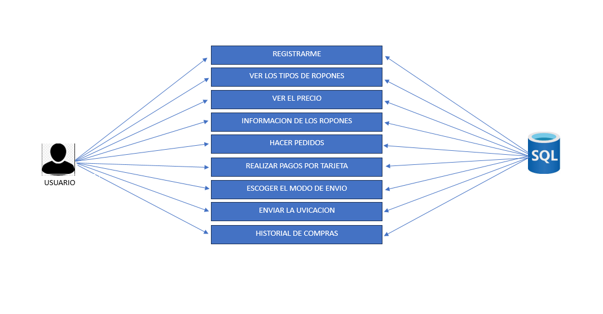
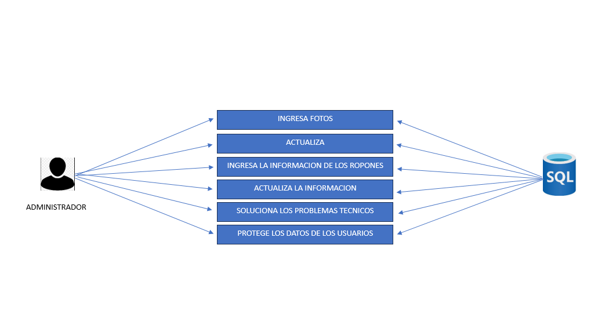

# LULUMELON
app de tienda de ropa 

# PROBLEMA
La aplicacion de tiendas se crea para resolver problemas que enfrentan tanto los comerciantes como los clientes en el contexto de las compras tradicionales. Algunos de los problemas que esta aplicacion aborda son:
 
> Para los comerciantes:
 
- Gestión de inventario: Las tiendas físicas a menudo enfrentan dificultades para llevar un registro preciso de su inventario, lo que puede llevar a escasez de productos o a la acumulación de artículos no vendidos. La aplicacion de tiendas puede ayudar a los comerciantes a gestionar su inventario de manera eficiente, realizando un seguimiento de los niveles de stock, las fechas de caducidad y los pedidos.
- Control de ventas: La aplicacion de tiendas puede ayudar a los comerciantes a realizar un seguimiento de sus ventas, identificar productos populares y analizar tendencias de compra. Esta información puede ser valiosa para tomar decisiones sobre la gestión del inventario, la fijación de precios.
- Atención al cliente: La aplicacion de tiendas puede mejorar la atención al cliente al permitir a los comerciantes responder a las preguntas de los clientes, proporcionar información sobre los productos y realizar un seguimiento de las solicitudes de servicio.
- Marketing: La aplicacion de tiendas puede ayudar a los comerciantes a llegar a nuevos clientes, promocionar productos y ofertas especiales.
 
> Para los clientes:
 
- Acceso a información: La aplicacion de tiendas puede proporcionar a los clientes información sobre los productos, los precios, las ofertas especiales y la disponibilidad en tiempo real.
- Facilidad de compra: La aplicacion de tiendas puede facilitar el proceso de compra al permitir a los clientes realizar pedidos en línea, pagar con sus teléfonos inteligentes y elegir opciones de entrega o recogida.
- Comparación de precios: La aplicacion de tiendas puede ayudar a los clientes a comparar precios entre diferentes tiendas y encontrar las mejores ofertas.
- Recomendaciones personalizadas: La aplicacion de tiendas puede utilizar los datos de compra de los clientes para recomendar productos que podrían interesarles.
 
## SOLUCION
La aplicacion de tiendas de ropa se crean para resolver problemas que enfrentan tanto los compradores como los vendedores en el mundo de la moda. Esta aplicacion busca mejorar la experiencia de compra, aumentar la comodidad y ofrecer nuevas posibilidades tanto para los clientes como para las marcas.
Para los usuarios:
 
- Comodidad y accesibilidad: La aplicacion de tiendas de ropa permite a los compradores explorar y comprar ropa desde la comodidad de sus hogares o en cualquier lugar con conexión a internet.
La aplicacion de tiendas de ropa ofrece información detallada sobre los productos, como tallas, colores, materiales, descripciones y opiniones de otros compradores.
- Comparación de precios: La aplicacion permite a los compradores comparar precios de diferentes tiendas y encontrar las mejores ofertas.
- Recomendaciones: la aplicacion utiliza reseñas para recomendar prendas que podrían interesar al usuario, basándose en sus compras anteriores o en sus preferencias.
- Acceso a promociones y ofertas: La aplicacion de tiendas de ropa suele notificar a los usuarios sobre promociones, descuentos y eventos especiales.
 
> Para el administrador:
 
- Mayor alcance: La aplicacione de tiendas de ropa permiten a las marcas llegar a un público más amplio, incluso a clientes que no están ubicados cerca de sus tiendas.
- Gestión de inventario: La aplicacion de tiendas de ropa pueden ayudar a los vendedores a gestionar su inventario, realizando un seguimiento de los niveles de stock y las tallas disponibles.
- Análisis de datos: La aplicacion de tiendas de ropa brindan información valiosa sobre el comportamiento de los clientes, como las prendas más populares, las tallas más demandadas y las tendencias de compra.
- Marketing digital.
 La aplicacion de tiendas de ropa permite a los vendedores realizar campañas de marketing digital, como promociones, anuncios y notificaciones.
 
En resumen, la aplicacion de tiendas de ropa se crean para optimizar la experiencia de compra tanto para los compradores como para los vendedores, ofreciendo una plataforma moderna y eficiente para el mundo de la moda.
 
## ACTORES
> usuario

- Los usuarios buscan comprar ropas de moda y tendencia
- Seleccionar Productos
> Administrador

- Gestión de Contenido 
- Control de Usuarios
- Resolución de Problemas
- Seguridad de la Información
- Análisis de Datos
- Colaboración con el Equipo de Desarrollo
- Planificación Estratégica
## HISTORIA DE USUARIO

## MAPA DE NAVEGACION

## DIAGRAMA DE CASOS DE USOS

## PATRON DE ARQUITECTURA 
MODELO VISTA CONTROLADOR
